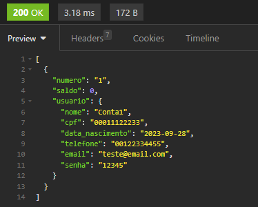
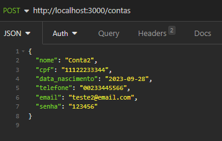

# API REST para um Banco Digital

### Descrição Geral
Este projeto constiste em uma API para uso em um sistema de Banco Digital. <br>
Implementada como desafio para o curso de Desenvolvimento de Software com foco em Back-End da Cubos Academy.

---
### Tecnologias utilizadas

 <br>

<br>

---
### Funcionalidades
#### `/get/contas <br>`

Lista todas as contas armazenadas no sistema, com informações tais como:
* Número indicador da conta
* Saldo do usuário
* Informações da conta

Para acessar estas informações é necessário informar a senha do banco via query param.

```senha_banco=Cubos123Bank```



#### `/post/contas`

Cria uma nova conta de usuário cujo ID é único.<br>
Conta com validações para garantir que o CPF e email do usuário é único.<br>
Para que a requisição seja completa os campos a seguir são obrigatórios:
* Nome
* CPF
* Data de Nascimento
* Telefone
* Email
* Senha



 #### `/put/contas/:numeroConta/usuario`

